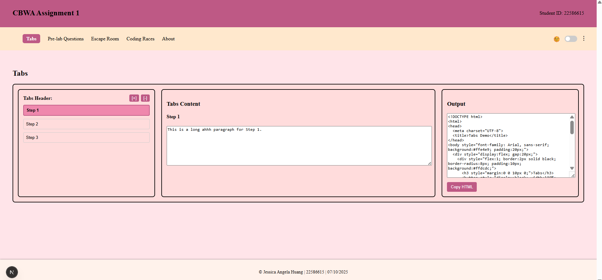

# 💼 FREELANCE SERVICES AGREEMENT (Assignment 1)

## 🧩 Project Overview

This project is part of **Assignment 1** for **CSE3CWA / CSE5006** at **La Trobe University**.  
The goal is to develop a **Next.js web application** that generates **HTML5 + JavaScript code** for deployment on **MOODLE LMS**.

The system simulates a **Freelance Services Agreement** web interface with responsive design, dynamic tab operations, and theme customization. The output can be exported as self-contained HTML code using inline CSS only.

---

## ✨ Key Features

### 🧭 User Interface
- Modular and reusable **React components** for:
  - **Navigation Bar (Tab Bar)**
  - **Header**
  - **Footer**
  - **About Page**
- Clean, consistent layout across all pages.
- Follows accessibility standards for better usability.
- Responsive design optimized for desktop and mobile views.

---

### 🎨 Themes
- **Dark Mode** and **Light Mode** support.  
- Users can toggle between modes easily.
- (Future-ready) Option to extend with additional custom color schemes.

---

### 🍔 Hamburger / Kabab Menu
- Includes a **Hamburger-style menu** for navigation.  
- Uses **CSS transform animations** for smooth menu transitions.
- Simplifies navigation across different devices.

---

### 🧱 Tabs Page (Operations)
- Dynamically **add (+)** or **remove (−)** up to **15 tabs**.  
- **Editable tab headings** — users can rename tabs.  
- **Editable tab content** — users can input and modify content directly.  
- **LocalStorage integration** 💾 *(optional, easily added in 2 lines later)*  
  - Saves and restores tab data automatically between sessions.  
- Supports accessibility and keyboard navigation for tab management.

---

### ⚙️ Output Button
- Generates **HTML5 + JavaScript** output with **inline CSS only**.  
- The generated code is **ready to paste** into an `.html` file for direct use.  
- Output verified for:
  - ✅ Single Tab Example  
  - ✅ Three Tabs Example  
  - ✅ Five Tabs Example  
- Ensures visual consistency and correct rendering when loaded.

---

### 🌿 GitHub Repository
- **Main Branch** with stable production code.  
- **Branch per Feature (3 Features)**:  
  - `feature-navbar`  
  - `feature-tabs`  
  - `feature-output`  
- Multiple **commits** showing incremental development and testing.  
- `.gitignore` excludes `node_modules` and unnecessary build artifacts.  
- **README file** kept up to date with latest features and screenshots.  

---

## 📸 Preview

---

## 📺 Demo Video

**YouTube Demo Link:** [Add your video link here]  
*(Showcasing navigation, theme toggle, tab operations, and HTML output)*

---

## 🧠 Technologies Used
- **Next.js (React Framework)**  
- **TypeScript**  
- **Tailwind CSS** (for initial styling and transitions)  
- **HTML5 / JavaScript (for generated output)**  

---

## 🧑‍💻 Developer Info
**Student Name:** Jessica Angela Huang  
**Student ID:** 22586615  
**Subject:** CSE3CWA / CSE5006  
**Institution:** La Trobe University  
**Date:** October 2025  